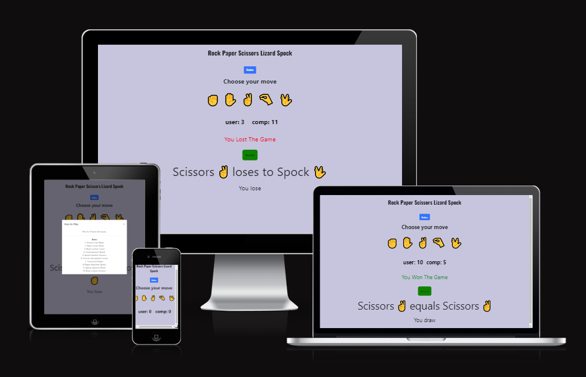
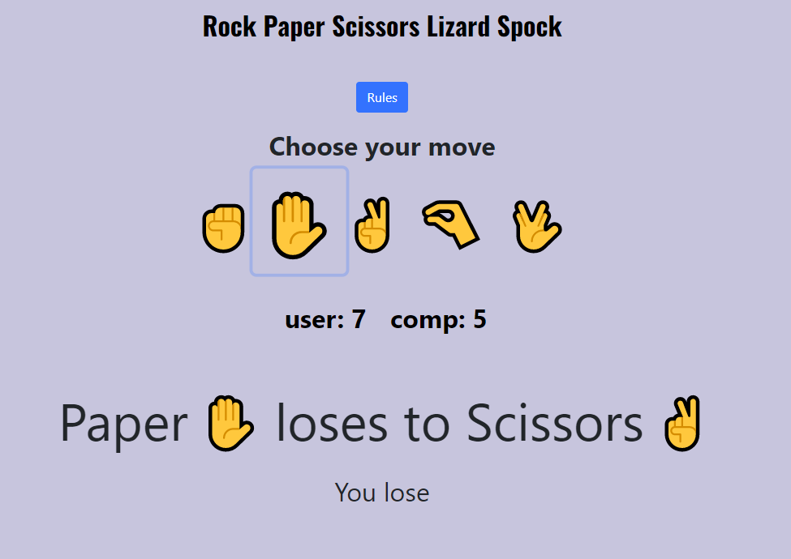
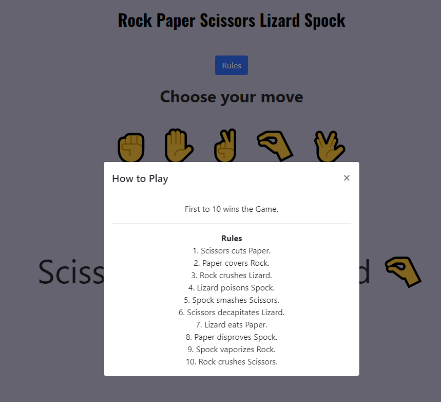
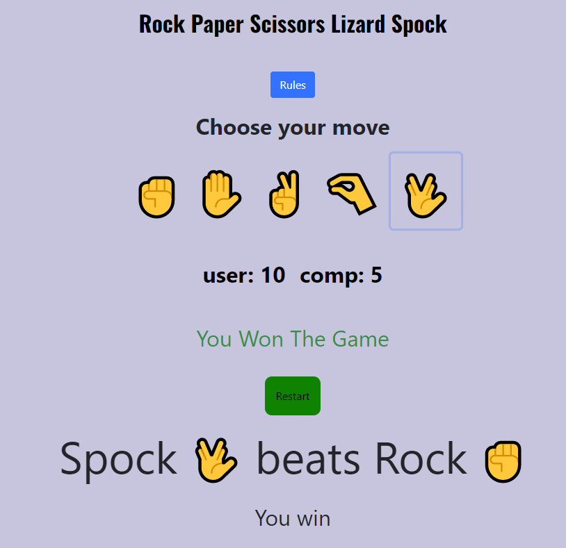
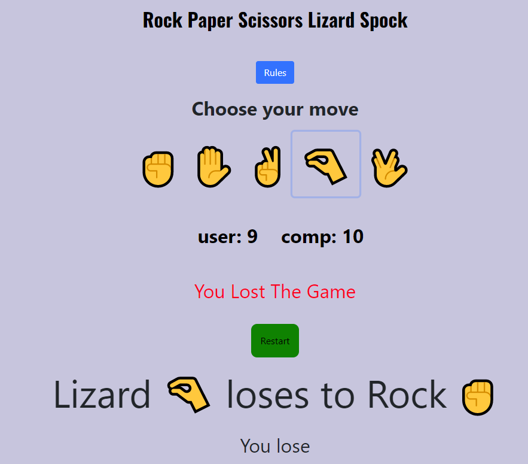
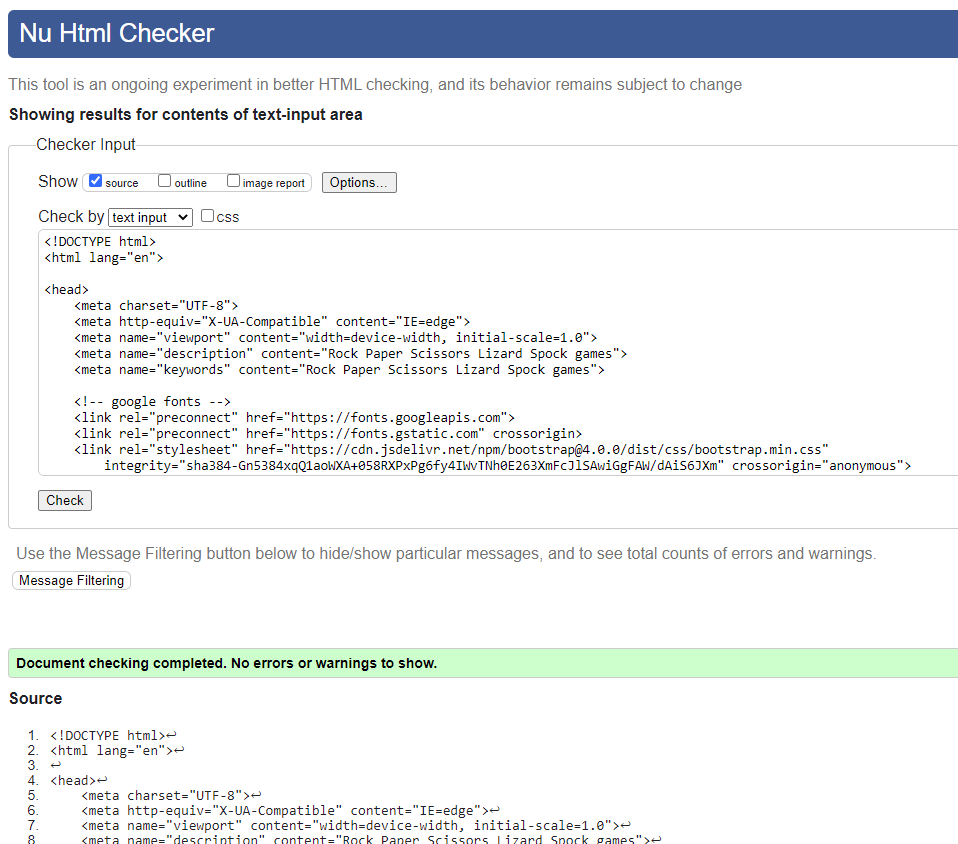
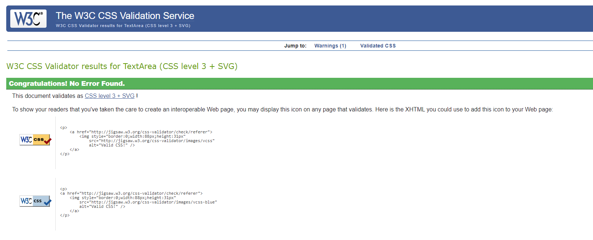
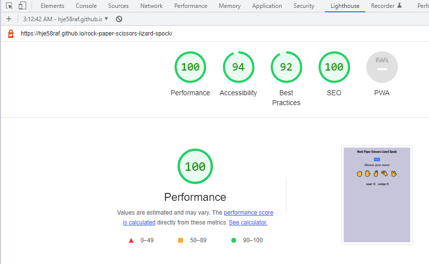
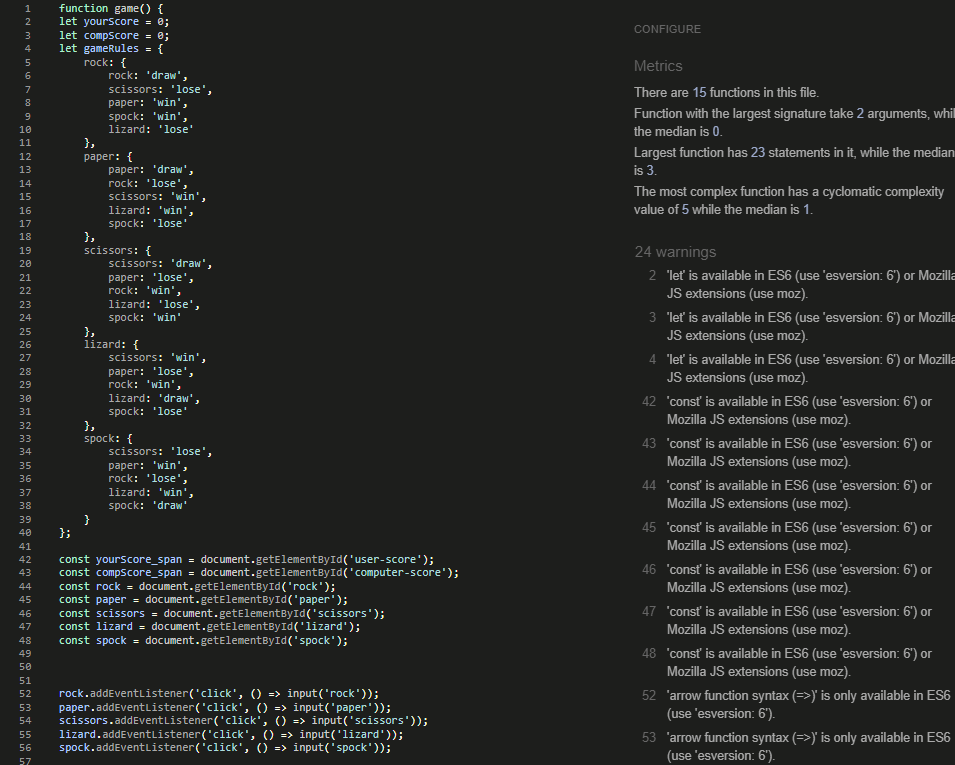

# Rock Paper Scissors Lizard Spock

[Rock Paper Scissors Lizard Spock](https://hje58raf.github.io/rock-paper-scissors-lizard-spock/)  is part of the Code Institute's Portfolio Project 2 - JavaScript Essentials. 

  

  

## Table of contents

- <a href="#intro">Introduction</a>
- <a href="#df">Design Features</a>
- <a href="#us">User Story</a>
- <a href="#test">Testing</a>
- <a href="#dep">Deployment</a>
- <a href="#fa">Future Aspirations</a>
- <a href="#cre">Credits</a>
- <a href="#tools">Tools used and Coding Inspiration</a>

---

<a href="#home">Return to table of contents</a>

## **INTRODUCTION.**

Rock Paper Scissors Lizard Spock is an extension of the classic game of chance, Rock Paper Scissors. In the game two opponents randomly toss out hand gestures, and each one wins, loses or draws. The first to reach the score of 10 wins.

---

<a href="#home">Return to table of contents</a>

## **DESIGN FEATURES.**

- ### **Header Bar.**

  

This is a simple header displaying the title of the game. 

- ### **Page Design.**
  The page content is presented in a clear and accessible fashion for the user to understand.

-  #### **Main Page.**

 

 

Below the header is the Rules modal button. Clicking on the button opens a popup window that contains the Rules and how to play. Below the Rules button is the main gameplay area. Game icons are animated to clearly show the user who they are playing with. This has the scoreboard clearly defined at the bottom of the page and a player feedback section just below.
There are two alternatives to the game screen when the game is either won or lost. The dialogue boxes are coloured appropriately depending on the scenario and the text is either celebratory or comiseratory.

- ## **MODAL SCREEN**

 

 

- ## **WIN SCREEN**

 

 

 - ## **LOSE SCREEN**

 

 

 
 This page is clear and simple to use. The design continues with the engaging and fun concepts as used on the main game play page. The page footer has had a link to the home page added for navigation purposes. The button under the form submits the form details.

- ## **COLOUR PALETTE.**
  The colour palette is purposefully simple and clean. It consists of the following six colour choices: 

  

    

 

The color scheme that was used for this game was a Light grayish blue color (#c6c6dd) for the background and the text is black, which really makes the text and images stand out. The users win displays in green and the computers win displays in red which in this context would show the user that the green score is positive and red is negatative. The modal button is blue. I used bright orange color (#f2b33d) for the icons.

- ### **Font.**
  The font used for the page is Oswald. 

---

<a href="#home">Return to table of contents</a>

## **USER STORY.**

- As a user, I want to be able to figure out what the game is.
- As a user, I want to easily be able to understand how to play the game.
- As a user, I want to know what  score the game is up too.
- As a user, I want to be able to easily navigate through the game.
- As a user, I want the score to be easily visible so I can clearly see who is winning.

---

<a href="#home">Return to table of contents</a>

## **TESTING.**

- ### **HTML Testing**

  The following test results were achieved for the page using the [W3C Markup Validation Service](https://validator.w3.org/)

    

- ### **CSS Testing**

  The following test results were achieved for the page using the [W3C CSS Validation Service](https://jigsaw.w3.org/css-validator/)

    

- ### **Chrome Dev Tools - Lighthouse - Testing**

  The Chrome dev tool - Lighthouse - Tests the overall performance, Accessibility, Web Development best practices and SEO. The following results were confirmed:

    

- ### **JavaScript Testing**

[JS Hint](https://jshint.com/) was used to check the quality and functionality of the JavaScript code. No significant issues were recorded and the rest of the feedback was directed at tidying up the syntax. 

    

- ### **Responsiveness Testing**

The following sites were used to test the web applications responsiveness: [Am I Responsive](https://ui.dev/amiresponsive) and [Media Genesis Responsive Design Checker](https://responsivedesignchecker.com/)

The 'Am I responsive generator' result image has been used at the start of this readme file. Please see the image at the top for the results. This page focuses on the following image viewport sizes -
  Desktop
  1600x992px scaled down to scale(0.3181)
  Laptop
  1280x802px scaled down to scale(0.277)
  Tablet
  768x1024px scaled down to scale(0.219)
  Mobile
  320x480px scaled down to scale(0.219). The site results indicate good performance on all viewport sizes.

The Media Genesis page gives the option to test the page on several different viewport screen sizes from Desktop 24 inch 1920 x 1200px resolution all the way down to the mobile viewport size of 320 x 480px. The site performed very well on all viewport size options.

- ### **User Testing**

Friends and family were the resource used to extensively test the usability of the web application. All icon play buttons were correctly configured and provided the correct feedback to the user, as indicated. The page was also subjected to the peer code review slack channel through Code Institute to be stringently put through it's paces.

---

<a href="#home">Return to table of contents</a>

## **DEPLOYMENT.**
### The site was deployed to GitHub pages. The steps to deploy are as follows: 

* In the GitHub repository, navigate to the Settings tab 
* From the source section drop-down menu, select the Master Branch
* Once the master branch has been selected, the page will be automatically refreshed with a detailed ribbon display to indicate the successful deployment. 

The live link can be found here - https://hje58raf.github.io/rock-paper-scissors-lizard-spock/

---

<a href="#home">Return to table of contents</a>

## **FUTURE ASPIRATIONS.**

The future features that I would Like to include are:
- Before starting the Game a prompt for the user to enter their name.
- The choice to play a multiplayer game with another random person online.

<a href="#home">Return to table of contents</a>

## **CREDITS**

### Content

- Web Dev Simplified video on youtube was a big help in how to structure the game. The Youtube video can be found [here](https://www.youtube.com/watch?v=1yS-JV4fWqY) and [here](https://www.youtube.com/watch?v=jaVNP3nIAv0) 
- Geeksforgeeks.org have a great write up on how to create a Rock, Paper, Scissors game, this is a very good read as it goes through all the steps in details and after reading the article it definitely helped me with the creation of my game. The article can be found [here](https://www.geeksforgeeks.org/rock-paper-and-scissor-game-using-javascript/).
- [Google Fonts ](https://fonts.google.com/) for the Typography used on the site.
- W3Schools was great help for syntax that I could not remember and also for looking up new syntax, as their sandbox displays exactly what it does and allows you to edit it to suit your needs. The website can be found [here](https://www.w3schools.com/).

<a href="#home">Return to table of contents</a>

## **TOOLS USED AND CODING INSPIRATION.**

The following tools, pages and tutorials were invaluable in helping me complete this project:

- [HTML5](https://en.wikipedia.org/wiki/HTML5)
- [CSS3](https://en.wikipedia.org/wiki/CSS#CSS_3)
- [Javascript](https://en.wikipedia.org/wiki/JavaScript)
- [GitPod](https://www.gitpod.io/)
- [freeCodeCamp. Javascript tutorial assistance](https://www.freecodecamp.org/)
- [GitHub](https://github.com/)
- [Google Fonts. Amatic SC font.](https://fonts.google.com/specimen/Amatic+SC?query=Amatic+)
- [W3C Markup Validation Service. HTML testing.](https://validator.w3.org/)
- [W3C CSS Validation Service. CSS testing.](https://jigsaw.w3.org/css-validator/)
- [JS Hint testing JavaScript code](https://jshint.com/)
- [Am I Responsive. Responsiveness testing.](https://ui.dev/amiresponsive)
- [Media Genesis Responsive Design Checker. Responsiveness testing.](https://responsivedesignchecker.com/)
- [Code Institute Tutor Support. Invaluable support and assistance. Excellent course material.](https://codeinstitute.net/ie/)

<a href="#home">Return to table of contents</a>

